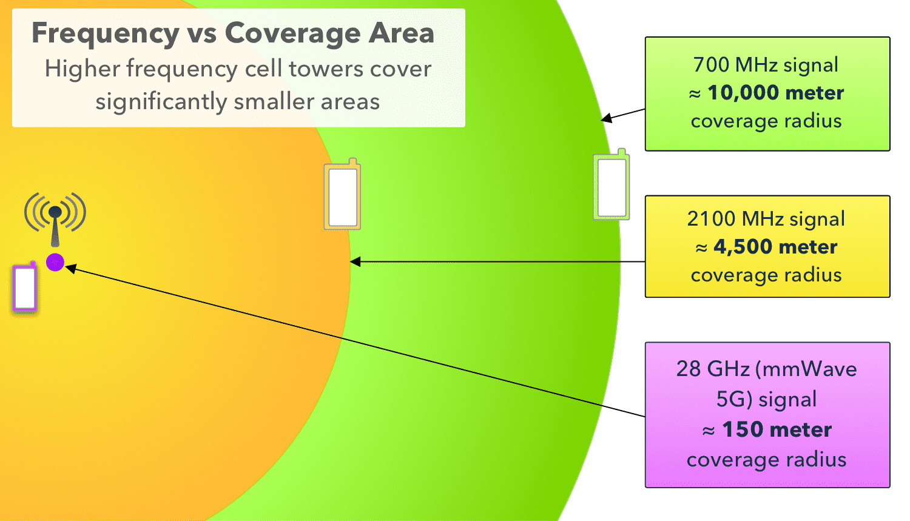

5G
==

.. post:: Nov 21, 2020
   :tags: 5G, hype
   :category:

.. note::
   - Updated
   - Work in Progress

*Home page* :ref:`Tech Talk Blog`

-----

The cellular industry is saying 2020 was  going to be the year of 5G. 
It will change the way we live, work, learn, play, and improve our global society. 
Whoopee!

Oh wait, some in the industry are now saying maybe sometime in the  2020s. 

Hype is the space between fact and fiction. 
The Hype storm that 5G is generating, is awesome. 

Most of 5G marketing is  Fiction, until the technology reaches the **Slope of Enlightenment** on the :ref:`Hype Cycle`

The 5G fiction is quickly climbing up the slope to  the peak of **Inflated Expectations**. 
Then it will slide down to the **Trough of Disillusionment** until it it begins to climb the **Slope of Enlightenment** and becomes reality.

.. toctree::
   

Cellular Networks Generations
-----------------------------

.. note:: 

   5G is the fifth generation technology standard for broadband cellular networks. It is very different than 4G and older wireless standards. It is extremely fast, require new phone hardware and software,  new towers with new hardware, and big changes to  phone and network designs. 
 
   It is the very fast  speed  your smartphone may some day use to connect to the Internet. 

   *G* Generations

- **1G**  1982 - 2.4 kbps - Retired

   First generation of broadband cellular network technology - Retired

   1G is an analog technology and the phones generally had poor battery life and voice quality was large without much security, and would sometimes experience dropped calls

- **2G**   1992 - 64 kbps - Retired

   The advance in technology from 1G to 2G introduced many of the fundamental services that we still use today, such as SMS, internal roaming , conference calls, call hold, etc..

- **3G**    1998 - 2 Mbps - Soon to be Retired

   This generation set the standards for most of the wireless technology, web browsing, email, video downloading, picture sharing and other Smartphone technology

- **4G**    2011 - 100 Mbps - A While Until Retirement

   4G is a very different technology than 3G and was made possible practically only because of the advancements in the technology in the last 10 years. 
   Its purpose is to provide high speed , high quality and high capacity to users while improving security and lower the cost of voice and data services, multimedia and internet.

- **5G**    10 Gbps? - Technology is Being Developed

..  figure:: _static/5Glogo.png   
   :width: 50%

   5G Logo

5G is not just an upgrade from 4G. 5G promises significantly faster data rates, higher connection density, much lower latency, among other improvements.

5G News
-------

- Apple New iPhone 12 Optimized for 5G

   It supports more 5G bands than any other smartphone, with all models connecting to both millimeter-wave and sub-6GHz spectrum, and a  data mode that switches  iPhone from 5G to LTE when 5G speeds aren't available or reliable.

   The blazing speeds promised will not materialize for most people using the  iPhone 12 or any 5G enabled device on today’s network. It is like trying to drive a Ferrari   200 miles per hour on roads  not built for that speeds. 
   
   There is not much one can do using a 5G iPhone that can not be done on a 4G iPhone, until the 5G network is up and running, and supporting :ref:`5G Spectrum`:.

- Apple's 5G Move Payoff

   As 5G hype leaves the :ref:`Hype Cycle` Trough of Disillusionment and begins ascending  the Slope of Enlightenment where consumers begin to understand the technology better and how it may benefit them, I think Apple's 5G move will pay off big time. By then, Apple will have multiple technology iterations able to effectively  utilize :ref:`5G Spectrum`:.

- Verizon Announces "Nationwide" 5G Coverage

   "Nationwide" doesn't mean it's available everywhere. It will not make much difference for most consumers buying 5G enabled phones 

   
   Verizon Coverage

- `Verizon's 5G Hype <https://www.verizon.com/about/news/fastest-5g-network-world-just-got-bigger-and-better>`_ 
   More than 200 million people in 1,800 cities around the US have been mislead. `The National Advertising Review Board <https://www.fiercewireless.com/operators/verizon-told-to-stop-most-powerful-5g-claim>`_ told Verizon in September it had to stop claiming it's building "the most powerful 5G experience for America." 

- AT&T’s  5G is Slow 

   AT&T’s 4G is faster in nearly every city tested by `PCMag <https://arstechnica.com/information-technology/2020/09/atts-current-5g-is-slower-than-4g-in-nearly-every-city-tested-by-pcmag/>`_

5G Stark Realities
------------------

..  figure:: _static/5Giceberg.png
   :width: 75%

   5G Iceberg

5G Technology Goals
:::::::::::::::::::

The core of new networking technologies are built using industry standards. The 5G standards are in a state of flux. Some early 5G deployments are doing makeovers because  standard  changes

There is a lot of excitement over 5G’s promise of blazing speeds, lower latencies, and more robust security than 3G and 4G networks. However,  network operator have their own timetable for rolling out the next-generation cellular technology. 5G will  be a patchwork of 3G, 4G, and 5G networks.  For the next few years, 5G won’t be able to fully deliver on its promises.

..  figure:: _static/5GTechnologyScope.png
   :width: 75%

   5G Technology Goals

Realizing these  three 5G technology goals is more complex than previous generations. Some of the necessary technology may not exist or be experimental, fewer engineers and technicians have the necessary skills, and high cost of deployment. Consumers may balk at higher product and service costs, and limited coverage

5G Spectrum
:::::::::::

Blazing speeds require using higher-frequency radio waves than 4G cellular networks

5G is an umbrella term. There are three 5G radio-frequency spectrum bands, 5G Low-band, 5G Mid-band, and 5G High-band. Additional  bands at higher frequencies may be added. 

.. figure:: _static/5g_layer_cake.png

   5G Layers
   

The capability of of 5G signals penetrating automobiles, weather conditions, buildings, glass, pockets, purses, vegetation, walls, and other obstacles, decreases at higher bands and frequencies.

..  figure:: _static/4G_5G_frequencies.png
   :width: 75%

   5G Spectrum

- **5G Low-band**

   Is  similar frequency range to current 4G cellphones, giving download speeds a little higher than 4G. Cell towers  have a range and coverage area similar to current 4G towers.  Obsticales that plague 4G penetration also plague 5G

- **5G Mid-band**

   The new mid-band spectrum  will improve data rates significantly over 4G, but with 55% less signal coverage than 5G Low-band.  There are more obsticales in the 5G Mid-band and they are more effective

- **5G High-band**

   The 5G High-band or the 5 millimeter wave band, is the 5G Holy Grail. It may achieve download speeds of a gigabit per second comparable to cable internet. There are  more effective obsticales in the 5G High-band

Coverage
::::::::

   Frequency vs Coverage Area

- **Low-band**

   The 5G Low-band  signal has about the same coverage as 4G

- **Mid-band**

   The 5G Mid-band has about 55% less coverage than the 5G Low-band

- **High-band**

   The 5G High-band has about 2% coverage of the 5G Low-band, and about 45% of the 5G Mid-band. 

Bottom Line
:::::::::::

This quote from Tom Wheeler a former chairman of the Federal Communications Commission  "If anyone tells you they know the details of what 5G will deliver, walk the other way."  may sum up contemporary 5G reality.

So, the bottom line is will consumers  jump on the rising **Inflated Expectation** part of the 5G :ref:`Hype Cycle`  only to experience falling to the **Trough of Disillusionment**, or wait for the **Slope of Enlightenment** when they understand the technology better and how it may benefit them?

5G Dreams
:::::::::

`Some Dreams of 5G <https://www.lifewire.com/5g-use-cases-4261046>`_

   - Broadband Internet Everywhere
   - Smart Vehicles, Cities, and Factories
   - Everything Is On-Demand
   - Immersive AR and VR
   - Smarter Healthcare
   - Better Law Enforcement
   - Peer-to-Peer (P2P) Communication
   - etc..

Some day, some dreams may come true

-----

.. rubric:: Footnotes:

*Home page* :ref:`Tech Talk Blog`
