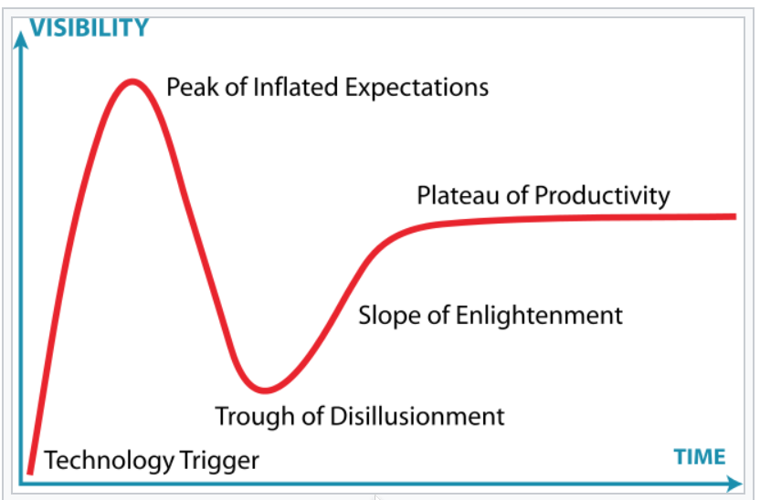

.. _about:

About
=====

Since the early days of the Internet, I have built blogs from scratch or used blog technology du jour. This blog is built using aBlog [#]_. It is a Sphinx [#]_  extension. Sphinx uses reStructuredText [#]_ as its markup language, and many of its strengths come from the power and straightforwardness of reStructuredText and its parsing and translating using the Docutils [#]_ suit,  

The Internet has been a part my life since its early days. I have decades of hands-on experience with some of the ever changing Electronic, Internet, and Software technologies, and a passion pursuing what’s new and improved within the these industries

Checking out what’s new or not, what’s real or not, or what’s new and improved, is something like panning for gold. Buried within the mountains of info rubble produced daily, every so often one finds nuggets making the effort worthwhile.

These industries are probably the fastest changing endeavors mankind has ever created. The half life of many products making it to market are relatively short. There are some very short lived and some that were just vapor.

Hype Cycle
----------

The Hype Cycle helps separate reality from fiction.

    
    HypeCycle

The Hype Cycle points of interest are:

**Technology Trigger**
    A potential technology breakthrough happens.

**Peak of Inflated Expectations**
    Early publicity produces a number of success stories and often accompanied by stories of failures. Some companies may take corrective action but most don’t.

**Trough of Disillusionment**
    Interest wanes as experiments and implementations fail to deliver on the hype.

**Slope of Enlightenment**
    Technology consumers begin to understand the technology better and how it may benefit them.

**Plateau of Productivity**
    Mainstream adoption starts to take off. Some technologies making it to the Plateau of Productivity may be doomed to the spiral of death by inattention to details of keeping them alive

.. rubric:: Footnotes:

.. [#] aBlog - https://ablog.readthedocs.io

.. [#] Sphinx - https://www.sphinx-doc.org/en/master/index.html

.. [#] reStructuredText - http://docutils.sourceforge.net/rst.html

.. [#] DocUtils - http://docutils.sourceforge.net