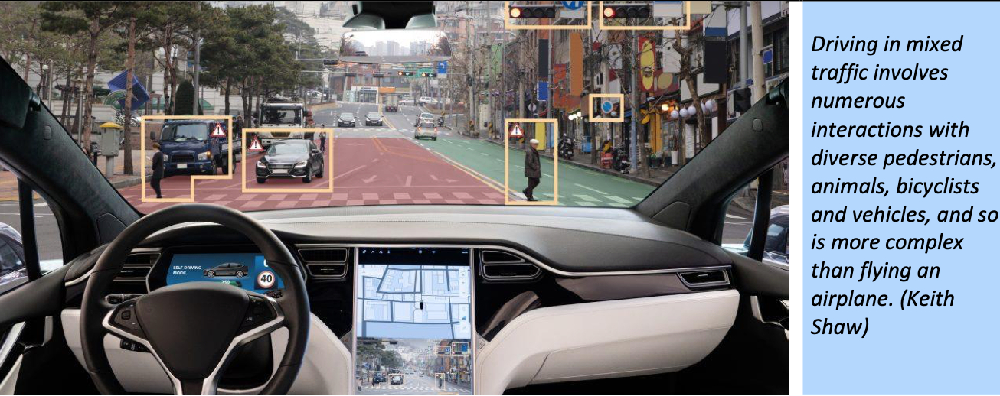
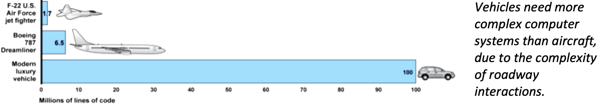
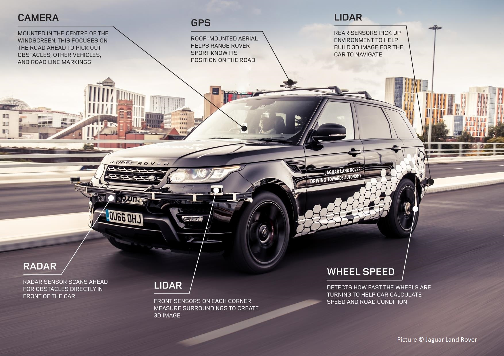
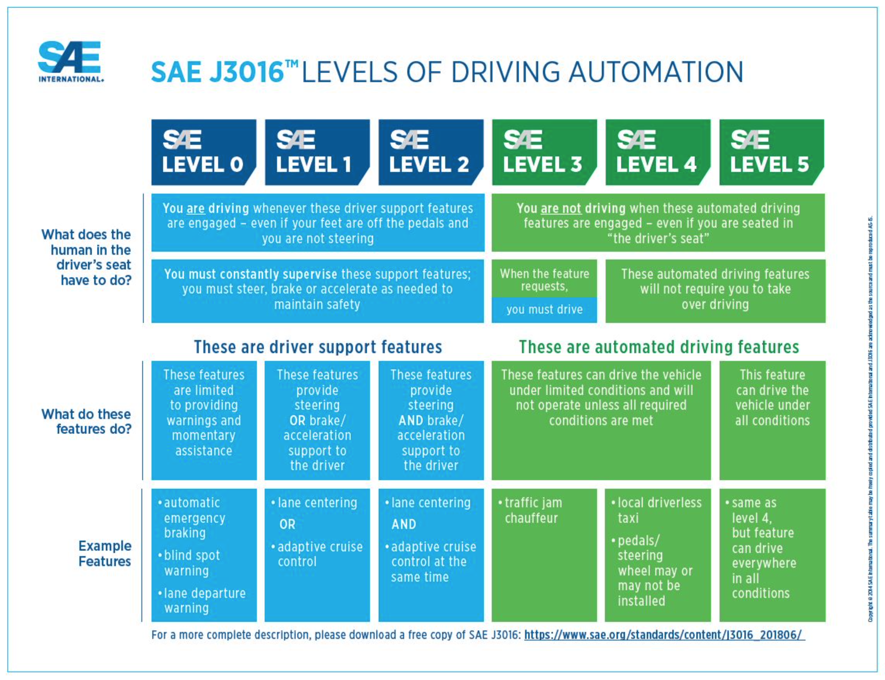

Autonomous Vehicles
====================

.. post:: 
   :tags: AV
   :category:

.. note::
   
   - Work in Progress

*Home page* :ref:`Tech Talk Blog`

-----

I like the idea of being delivered to my destination by AVs (Autonomous Vehicles). Some AV vendors fact-free Hype [5]_ storms are raging. Others are quieting down as reality sets in. 

Overview
--------

The *Autonomous Vehicle Implementation Predictions
Implications for Transport Planning* report [#]_ by
Todd Litman, Victoria Transport Policy Institute. It explores the impacts of AVs. It may be the most factual publication or article, free of financial interests 

   "Optimists predict that by 2030, autonomous vehicles will be sufficiently reliable, affordable and common to displace most human driving, providing huge savings and benefits. However, there are good reasons to be skeptical. Most optimistic predictions are made by people with financial interests in the industry, based on experience with disruptive technologies such as digital cameras, smart phones and personal computers. They tend to ignore significant obstacles to autonomous vehicle development, and exaggerate future benefits."

   "There is considerable uncertainty concerning autonomous vehicle development, benefits and costs, travel impacts, and consumer demand. Considerable progress is needed before autonomous vehicles can operate reliably in mixed urban traffic, heavy rain and snow, unpaved and unmapped roads, and where wireless access is unreliable. Years of testing and regulatory approval will be required before they are commercially available in most jurisdictions. The first commercially available autonomous vehicles are likely to be expensive and limited in performance. They will introduce new costs and risks. These constraints will limit sales. Many motorists will be reluctant to pay thousands of extra dollars for vehicles that will sometimes be unable to reach a destination due to inclement weather or unmapped roads.
   
   "Autonomous vehicles currently have relatively high operational failure rates." 

   "Autonomous vehicles are vulnerable to hacking. In one experiment, researchers demonstrated that adding graffiti-like marks to a roadside stop-sign caused software to read an inaccurate "Speed Limit 45". There will be an on-going arms race between hackers and software designers over autonomous vehicles control, which will add costs and risks."

Traffic Safety and Security

   Optimists claim that, because human error contributes to 90% of crashes, autonomous vehicles will reduce crash rates and insurance costs by 90%, but this overlooks additional risks these technologies can introduce

   - Hardware and software failures. Complex electronic systems often fail due to false sensors, distorted signals and software errors. Self-driving vehicles will certainly have failures that contribute to crashes, although their frequency is difficult to predict.

   - Malicious hacking. Self-driving technologies can be manipulated for amusement or crime.

   - Increased risk-taking. When travelers feel safer they tend to take additional risks, called offsetting behavior or risk compensation. For example, autonomous vehicle passengers may reduce seatbelt use, and other road users may be less cautious, described as "over-trusting" technology.
   
   - Platooning risks. Many potential benefits, such as reduced congestion and pollution emissions, require platooning (vehicles operating close together at high speeds on dedicated lanes), which can introduce new risks, such as human drivers joining platoons and increased crashes severity. Increased total vehicle travel. By improving convenience and comfort autonomous vehicles may increase total vehicle travel and therefore crash exposure.

   - Additional risks to non-auto travelers. Autonomous vehicles may have difficulty detecting and accommodating pedestrians, bicyclists and motorcycles. Reduced investment in conventional safety strategies. The prospect of autonomous vehicles may reduce future efforts to improve driver safety.

   - Higher vehicle repair costs due to additional equipment. Additional sensors and control systems, and increased quality control, are likely to significantly increase collision repair costs.
   
There Are No AVs For Sale
-------------------------

AVs are also known as self-driving.

There are six levels (0-5) of car autonomy from “no automation” to “full automation” :ref:`Levels of Driving Automation` .  Most of us are driving Level 0, no automation, or Level 1, driver assistance AV. A few like Tesla that are ranked at Level 2, partial Assistance. Fewer like the Audi A8 are ranked at Level 3, conditional assistance. The prophecy is some Level 4 AV are being tested on public roads. There are a few full AV Level 5 concept AV being tested. Honda and Tesla are are promoting AV Level 5 is soon to be available. 

Technology leaps are needed before AV can interact with humans and handle novel situations gracefully.

There are other challenges. AI (Artificial Intelligence) used in AV comes with some drawbacks. AI struggles when it deals with something it hasn’t learned. It is hard to deal the with the unpredictable, stupid, and crazy things human drivers, pedestrians and animals do. When a AV makes an ill-advised decision, it’s extremely difficult to debug the vehicles. Unlike an airplane black box. 

AV will need fifth generation wireless, 5G [#]_, widely deployed before they are self-diving. There are major 5G problems to be solved before AV can be truly be AV. Consumer 5G smartphones will have similar problems. 

Defects are Lurking
-------------------

My primary concern about AVs is developing, testing, and updating onboard hardware and software. AVs need more complex computer systems than aircraft because of roadway interactions, and driving a vehicle is more difficult than flying a plane. 

Driving defensively requires constant evaluation of ever changing conditions, and to quickly respond to other drivers, people, animals, weather conditions, and many more known or unknown hazards.

   Driving In Mixed Traffic

Complex Complexity
------------------

Vehicles need more complex computer systems than aircraft, due to the complexity of roadway interactions.

Defects in computer systems are the way of things. They are lurking in AVs ever evolving hardware, component, and software products from various sources. Vendors do a herculean task of creating, testing, and updating their products. Some more than others. Fixing defects with updates is a fact of computer technology.

Updating may be AVs Achilles heal. Use Microsoft as an example. It has been developing, selling, and updating software since 1975. The complexity of Microsoft ecosystem is less than AVs. It became market-dominate in selling PC compatible operating systems and office software suite markets. Microsoft updates still stumble sometimes. Some PC users and business IT staff dread Update Tuesday because of the collateral damage updates may inflict [#]_ , but users and staff do not usually die.

Certification and Black Boxes
-----------------------------

I think it would be appropriate

AVs
---

    AV

There are several varieties of computers,  electronics, and software  supporting the highlighted technologies in the AV figure. More varieties are supporting things like engine control and monitoring, GPS, entertainment console, and so much more.

Levels of Driving Automation
----------------------------

Thee are six levels of car autonomy from “no automation” to “full automation” as defined by the SAE International (Society of Automotive Engineers) [#]_

   SAE J3016

Human driver monitors the driving
.................................

Level 0 - No Automation. 

   - Most vehicles are at this level today. They are vehicles where the driver does everything. The human driver controls all aspects of driving – from steering to operating the pedals, monitoring surroundings, navigating, and determining when to signal or maneuver. The car may have some automated warning tones and automated emergency braking.

Level 1 - Driver Assistance. 

   - The driving mode-specific execution by a driver assistance system of either steering or acceleration/deceleration using information about the driving environment and with the expectation that the human driver perform all remaining aspects of the dynamic driving task.- SAE  J3016

   - Vehicles with this level of autonomy, in some driving modes, can handle steering or throttle and braking – but never both. Most functions are controlled by the driver. However, there are some systems that will step in to control the car. These might keep the car in its lane without input from the driver. Or they might brake the car and accelerate to maintain a set speed and distance in relation to the car in front. The driver is still primarily in control and these systems don’t work together. Even when the car is making decisions, the driver must be ready to step in at any moment. AV with radar assisted ‘active cruise control’ fall into this category.

Level 2 - Partial Assistance. 

   - "The driving mode-specific execution by one or more driver assistance systems of both steering and acceleration/deceleration using information about the driving environment and with the expectation that the human driver perform all remaining aspects of the dynamic driving task." - SAE J3016

   - More than one system works together governing acceleration/deceleration and steering by using information gathered by the car from the driving environment. The driver performs all other elements of driving and remains in total control of the car. This might be a car that has radar-assisted cruise control working with Lane Keep Assist.

   - Vehicles can handle the steering and throttle and braking in some driving modes at Level 2. The driver must be alert at all times, be ready to take over the control of the vehicle, and is still responsible for monitoring the surroundings, traffic and road conditions.

   - An example of Level 2 autonomy is Tesla’s Autopilot system. This is a suite of driver assistance technologies including Traffic Aware Cruise Control and Auto-steer with lane change, which enables automatic steering on undivided roads but with speed restrictions.

   - Other AV that have Level 2 systems are Volvo Pilot Assist, Mercedes-Benz Drive Pilot, and Cadillac Super Cruise.

Automated Driving System (“system”) Monitors The Driving Environment
.....................................................................

Level 3 - Conditional Assistance

   - "With Level 3 autonomy, the vehicle can monitor its surroundings, change lanes, and can control the steering, throttle and braking in certain situations, such as on motorways. However, the driver must be ready to take back control of the vehicle when required." - SAE J3016

   - This level of autonomy has been termed conditional automation. An automated driving system that takes over all aspects of the driving process. It assess conditions around the car, accelerate, decelerate and even change lane without any human input. However, the driver must still be on hand and ready to intervene if the car requests it. Crucially, the human doesn’t have to be paying attention as much as in the previous levels.

   - The Audi A8 is the first production car to have Level 3 autonomy. Unfortunately regulators currently prohibit Level 3 autonomy. The A8′s AI Traffic Jam Pilot manages starting, steering, throttle and braking in slow-moving traffic at up to 60km/h on major roads where a physical barrier separates the two carriageways. When the system reaches its limits the driver is alerted to take over the driving.

   - Audi has said it will use a step-by-step approach to the introduction of the traffic jam pilot in its production models, because of local laws and regulations regarding autonomous diving.

Level 4 - High Automation

   - "The driving mode-specific performance by an automated driving system of all aspects of the dynamic driving task, even if a human driver does not respond appropriately to a request to intervene" - SAE J3016

   - These AV are probably what we think of when someone says the words ‘autonomous vehicle’

   - Level 4 automated AV can drive themselves with a human driver onboard. The car takes control of the starting, steering throttle and braking as well as monitoring its surroundings in a wide range of environments and handling the parking duties.

   - When the conditions are right, the driver can switch the car to autonomous mode. When the vehicle encounters something that it cannot read or handle it will request the assistance of the driver.

   - However, even if the driver does not intervene and something goes wrong, the car will continue to maneuver autonomously.

   - These AV are truly self-driving and the Google/Waymo self-driving vehicle has been tested at this level of autonomy on public roads for some time.

Level 5 - Full Automation

   - "The driving mode-specific performance by an automated driving system of all aspects of the dynamic driving task, even if a human driver does not respond appropriately to a request to intervene" - SAE J3016

   - The vehicle does not need human control. Humans are nothing but cargo. It doesn’t need to have pedals, or a steering wheel, or a human onboard.

   - The car is fully automated and can do all driving tasks on any road, under any conditions, whether there’s a human on board or not.

   - Some concept AV are Level 5 AV – including the Volkswagen Group SeDriC (SElf-DRIving Car), above, and the Audi AIcon concept."

Testla's Elon Musk
------------------

   I think Tesla CEO Elon Musk is the best car salesman, ringmaster, poster child, con, etc.. for the AV Hype Cycle [#]_. Some of Musk’s statements are contrary to the SAE J3016 Six Levels Of Driving Automation, and reality.

First Look at Tesla’s Holiday Software Update [#]_

   All cool stuff, but it is a drop in a bucket for what is needed within 2 years to transform Tesla products from Level 2 Partial Assistance to Level 5 Full Automation AV, that was talked up April 15, 2019 Musk predicts Tesla will achieve full autonomy by 2020.

   Level 5 Full Automation require the vehicle does not need human control. It doesn’t need to have pedals, or a steering wheel, or a human onboard. It is fully automated and can do all driving tasks on any road, under any conditions, whether there’s a human on board or not.

   And, it must deal the with the unpredictable, stupid, and crazy things human drivers and pedestrians do.

   "The latest 2019.40.50 firmware gives Tesla owners with Autopilot Hardware 3 a preview of its upcoming Full-Self driving capabilities, showcasing an increasingly more intelligent Tesla Neural Net that’s able to identify and display multiple traffic lights, stop signs, and even garbage cans on the vehicle’s touchscreen. The ability to render road markings and vehicle types, in detail, on-screen paves the way for Tesla’s upcoming “feature complete” Full-Self Driving suite."

Tesla’s New Ai Chip Isn’t A Silver Bullet For Self-Driving Cars [#]_

   "At Tesla’s Autonomy Day event for investors, CEO Elon Musk described the new FSD (Full Self-Driving) computer that will power Tesla’s vehicles, Musk said they contained what was “objectively” the “best chip in the world.” And that’s not best by a little, but “by a huge margin.""

   "Experts and rivals beg to differ. They say this claim should be taken with a pinch of salt, and that while Tesla’s new hardware is impressive, it doesn’t provide an insurmountable advantage for the company, nor will it solve the challenges facing AV."

Musk Predicts Tesla Will Achieve Full Autonomy By 2020

   "Tesla is less than two years away from full self-driving, CEO Elon Musk said in an interview. And said Tesla was far ahead of other companies working on self-driving technology."

   It did not happen. Not even close. Saying something doesn't make it real. What magic transforms a Level 2 Partial Assistance Tesla into a Level 5 Full Automation in less than 2 years? I think this would probably be the biggest  magic show ever.

   "To me right now, this seems 'game, set, and match,'" Musk said. "I could be wrong, but it appears to be the case that Tesla is vastly ahead of everyone."

   "Musk said Tesla customers would need to keep their hands on the wheel "for at least six months or something like that." But he predicted that soon—"maybe even toward the end of this year, I’d be shocked if it’s not next year at the latest"—Tesla’s self-driving technology will become so good that "having a human intervene will decrease safety."

AVs Maybe in 20xx
-----------------

   "Most objective experts acknowledge that Level 5 automation will require many more years for development and testing It may be decades before a vehicle can drive itself safely at any speed on any road in any weather. Toyota Research Institute CEO, Gill Pratt stated that autonomous driving, "is a wonderful goal but none of us in the automobile or IT industries are close to achieving true Level 5 autonomy." Nobody has a solution to self-driving cars that are reliable and safe enough to work everywhere." Not even :ref:`Testla's Elon Musk`

The AV Players
--------------

The AV players list is quickly changing. The *List Of Companies That Are Leading The Market Of Autonomous Vehicles Or Self-Driving Cars* [#]_  article captures the names and provides a blurb about several of the AV players. The players and their blurb have most likely changed since this post.

-----

.. rubric:: Footnotes:

.. [#] Autonomous Vehicle Implementation Predictions Implications for Transport Planning: https://www.vtpi.org/avip.pdf

.. [#] 5G: https://techtalkjohn.com/5g/

.. [#] Microsoft Windows update problem 2020: https://duckduckgo.com/?q=microsoft+update+problem+2020&t=osx&ia=web

.. [#] SAE International: https://www.sae.org/misc/pdfs/automated_driving.pdf

.. [#] Hype Cycle: https://www.gartner.com/en/research/methodologies/gartner-hype-cycle

.. [#] First Look at Tesla’s Holiday Software Update: https://www.teslarati.com/tesla-holiday-software-update-video-text-messaging-camp-mode-demo/

.. [#] Tesla’s New Ai Chip Isn’t A Silver Bullet For Self-Driving Cars: https://www.theverge.com/2019/4/22/18510828/tesla-elon-musk-autonomy-day-investor-comments-self-driving-cars-predictions

.. [#] List Of Companies That Are Leading The Market Of Autonomous Vehicles Or Self-Driving Cars: https://www.analyticsinsight.net/top-10-autonomous-vehicle-companies-watch-2020/

*Home page* :ref:`Tech Talk Blog`